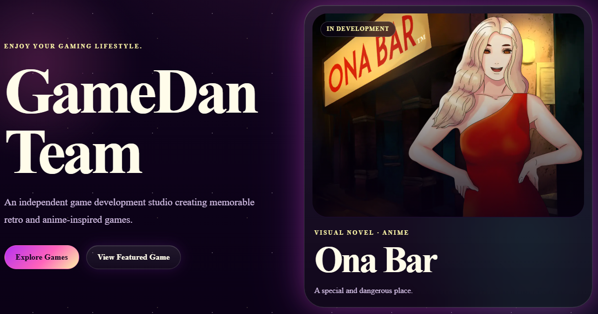

# GameDan Team --- Indie Game Studio Website

Official website developed for **GameDan Team**, an independent game
development studio creating retro and anime-inspired games.

Built with **React, Next.js and TypeScript**, the project uses a
component-based and data-driven architecture to manage a growing game
catalog, dynamic game pages, playable HTML5 titles, interactive media,
SEO metadata and a production contact system.

The project was designed both as a real production website for the
studio and as a scalable frontend architecture that allows new games and
content to be added without rebuilding the site structure.

------------------------------------------------------------------------

## Live Website

https://gamedanteam.com

------------------------------------------------------------------------

## Preview



------------------------------------------------------------------------

## Overview

GameDan Team required more than a traditional studio website. The goal
was to create a platform capable of presenting and managing multiple
games with different statuses, platforms, media and distribution
options.

Instead of creating individual hard-coded pages for every title, the
website uses centralized TypeScript game data combined with reusable
React components and dynamic Next.js routes.

This allows the game catalog to grow while keeping the UI and codebase
consistent.

The website includes:

-   A complete game catalog
-   Dynamically generated game detail pages
-   Playable HTML5 games
-   Game trailers
-   Screenshot galleries with lightbox navigation
-   Bandcamp and SoundCloud soundtrack integration
-   Platform, genre and development status information
-   Responsive layouts
-   Dynamic SEO metadata
-   A production contact form
-   Anti-spam protection
-   Automated production deployment

------------------------------------------------------------------------

## Key Features

### Data-Driven Game Catalog

Game information is centralized in TypeScript rather than being
duplicated across individual pages.

Each game can define information such as:

-   Title
-   Slug
-   Description
-   Development status
-   Genres
-   Platforms
-   Release date
-   Cover artwork
-   Screenshots
-   Trailer
-   Soundtrack
-   Distribution links
-   HTML5 playable version

Reusable React components consume this data to build the different areas
of the website.

This makes adding and maintaining games significantly easier and keeps
content separate from presentation logic.

### Dynamic Game Routes

Individual game pages are generated through the Next.js App Router using
dynamic routes:

``` text
/games/[slug]
```

The same page architecture is reused for the entire catalog while
displaying game-specific content.

Each game page can conditionally render available features such as:

-   Trailer
-   Screenshot gallery
-   Soundtrack
-   Release information
-   Platform badges
-   External distribution links
-   Playable browser version

### Playable HTML5 Games

Supported titles can be launched directly from the website through
dedicated routes:

``` text
/play/[slug]
```

The player architecture embeds HTML5 games inside a responsive game
container and allows selected titles from the catalog to be played
directly in the browser.

### Interactive Media Components

The website contains reusable components for different types of game
media:

-   YouTube trailers
-   Screenshot galleries
-   Modal image lightbox
-   Previous / next image navigation
-   Keyboard controls
-   Bandcamp soundtrack embeds
-   SoundCloud soundtrack embeds

Media sections are rendered only when the corresponding game data is
available.

### Responsive UI

The interface was designed to work across desktop, tablet and mobile
devices.

Responsive behavior includes:

-   Adaptive navigation
-   Responsive game grids
-   Flexible media layouts
-   Scalable typography
-   Responsive images
-   Mobile-friendly game pages
-   Touch-friendly controls and navigation

### Accessibility

Accessibility was considered throughout the interface with:

-   Semantic HTML
-   Keyboard-accessible navigation
-   Alternative text for images
-   Accessible interactive controls
-   Visible focus states
-   Appropriate heading hierarchy
-   Responsive and readable typography

------------------------------------------------------------------------

## Architecture

The website follows a data-driven component architecture:

``` text
Game data
    ↓
TypeScript types
    ↓
Reusable React components
    ↓
Dynamic Next.js routes
    ↓
Static generation
    ↓
Production build
    ↓
GitHub Actions
    ↓
SSH + rsync
    ↓
Production server
```

Game content is separated from the components responsible for rendering
it.

This means that adding a new game primarily involves adding its data and
media assets rather than creating an entirely new page implementation.

------------------------------------------------------------------------

## Technologies Used

### Frontend

-   React
-   Next.js
-   TypeScript
-   HTML5
-   CSS3

### Next.js

-   App Router
-   Dynamic routes
-   Static generation
-   Static export
-   Dynamic metadata
-   Optimized image handling
-   Route-based architecture

### Backend

-   PHP contact endpoint
-   Server-side form validation
-   Email delivery through the hosting mail server

### Deployment

-   Git
-   GitHub
-   GitHub Actions
-   SSH
-   rsync
-   GoDaddy Web Hosting

------------------------------------------------------------------------

## Project Structure

A simplified view of the project architecture:

``` text
src/
├── app/
│   ├── about/
│   ├── contact/
│   ├── games/
│   │   └── [slug]/
│   ├── play/
│   │   └── [slug]/
│   ├── layout.tsx
│   └── page.tsx
│
├── components/
│   ├── games/
│   ├── home/
│   └── ...
│
├── config/
│   └── brand.ts
│
├── data/
│   └── games.ts
│
└── types/

public/
├── games/
├── icons/
└── ...
```

The structure separates application routes, reusable UI components, game
data, type definitions, brand configuration and static assets.

------------------------------------------------------------------------

## Contact Form & Security

The contact page uses a React form connected to a PHP endpoint running
on the production server.

The form includes both client-side and server-side validation.

Anti-spam measures include:

-   Honeypot bot detection
-   Server-side honeypot validation
-   IP-based rate limiting
-   Maximum request size validation
-   Email header injection protection
-   Input validation and sanitization

The rate limiter allows a maximum of **3 valid submissions per IP within
10 minutes**.

Email authentication is configured for the production domain using:

-   SPF
-   DKIM
-   DMARC

------------------------------------------------------------------------

## SEO

SEO support is integrated into the application architecture rather than
being limited to static page titles.

The project includes:

-   Page-specific metadata
-   Dynamic game metadata
-   Canonical URLs
-   Open Graph metadata
-   Twitter metadata
-   JSON-LD structured data
-   `sitemap.xml`
-   `robots.txt`
-   Web app manifest
-   Favicons and application icons

Dynamic game routes generate metadata based on the corresponding game
data.

------------------------------------------------------------------------

## Performance

The website uses static generation and static export to minimize
server-side processing for frontend pages.

Performance considerations include:

-   Static production output
-   Optimized images
-   Responsive image sizes
-   Lazy-loaded third-party media where appropriate
-   Reusable components
-   Conditional rendering of game media
-   Lightweight production hosting

Lighthouse testing was used during development to review performance,
accessibility, best practices and SEO.

------------------------------------------------------------------------

## CI/CD & Deployment

Production deployment is automated with **GitHub Actions**.

Every push to the `main` branch triggers the deployment pipeline:

``` text
Push to main
      ↓
GitHub Actions
      ↓
Install dependencies
      ↓
Next.js production build
      ↓
Static export
      ↓
SSH connection
      ↓
rsync synchronization
      ↓
Production server
```

The deployment workflow builds the project and synchronizes the
generated static files with the production server using **SSH and
rsync**.

This avoids manual FTP deployment and only transfers files that need to
be updated.

The website is deployed to:

``` text
https://gamedanteam.com
```

------------------------------------------------------------------------

## Local Development

Clone the repository:

``` bash
git clone https://github.com/alejandroarevaloprogrammer/gamedan-team-web.git
```

Enter the project directory:

``` bash
cd gamedan-team-web
```

Install dependencies:

``` bash
npm install
```

Start the development server:

``` bash
npm run dev
```

Open:

``` text
http://localhost:3000
```

Create a production build:

``` bash
npm run build
```

------------------------------------------------------------------------

## What I Learned

This project allowed me to work with a larger frontend architecture than
my previous websites and to apply React and Next.js to a real production
project.

Some of the main areas I worked on include:

-   Designing reusable React components
-   Structuring a Next.js App Router application
-   Working with TypeScript data models
-   Building data-driven interfaces
-   Generating pages from dynamic routes
-   Managing conditional content across multiple games
-   Creating interactive client components
-   Integrating external media providers
-   Embedding HTML5 games
-   Implementing dynamic SEO metadata
-   Connecting a React frontend to a PHP contact endpoint
-   Implementing server-side validation and anti-spam protection
-   Configuring domain email authentication
-   Building an automated CI/CD workflow
-   Deploying production builds through SSH and rsync
-   Testing responsive behavior, accessibility, SEO and performance

The project also helped me understand how frontend architecture,
hosting, DNS, email authentication and deployment workflows interact in
a real production environment.

------------------------------------------------------------------------

## Author

**Alejandro Arevalo Rojas**\
Front-End Developer

GitHub: https://github.com/alejandroarevaloprogrammer

Portfolio: https://www.alejandroarevalorojas.com

------------------------------------------------------------------------

## About GameDan Team

GameDan Team is an independent game development studio creating retro
and anime-inspired experiences.

**Enjoy your gaming lifestyle.**

https://gamedanteam.com
